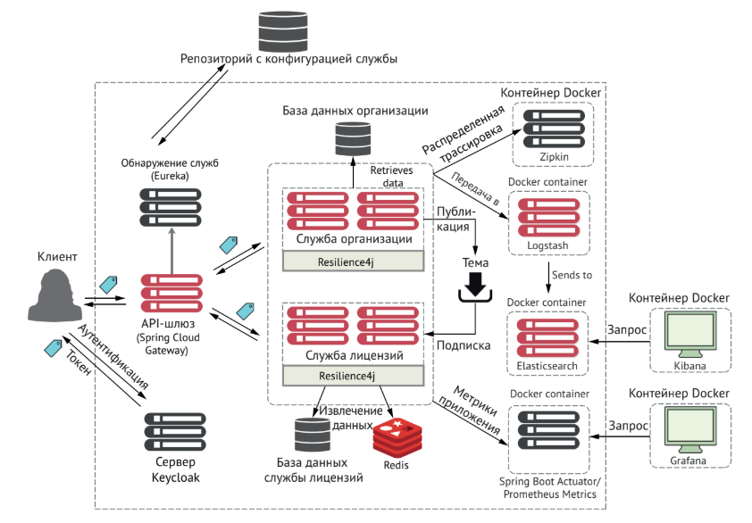

in the root dir:\
`mvn clean package` or `mvn clean package dockerfile:build`\
`sudo docker compose up -d --build`\

1. Config Server: http://localhost:8888
2. Eureka: http://localhost:8761
3. Gateway: http://localhost:8765
4. Keycloak: http://keycloak:7080
5. organization-service: 8084 or through gateway
6. licensing-service: 8081 or through gateway
